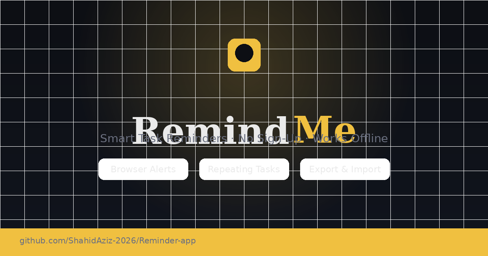

# ⏰ RemindMe – Smart Task Reminder App

[](LICENSE)


A beautiful, **offline-ready** task reminder app built as a **single HTML file**. No account, no server, no framework — just open `index.html` in any browser.



---

## ✨ Features

| Feature | Details |
|---|---|
| 🔔 Browser Notifications | Native alerts when your reminder fires (tab must be open) |
| 🔁 Repeating Reminders | Daily / Weekly / Monthly auto-scheduling |
| 🎯 Priority Levels | High / Medium / Low with colour-coded badges |
| 🔍 Search & Filter | Filter by status, priority, and free-text search |
| 📦 Export / Import | Back up and restore your reminders as JSON |
| 💾 Persistent Storage | All data saved in `localStorage` – survives refreshes |
| 📱 Responsive | Works on desktop and mobile browsers |

---

## 🚀 Getting Started

### Option 1 — Open locally (zero setup)
```bash
git clone https://github.com/ShahidAziz-2026/Reminder-app.git
cd Reminder-app
# Just double-click index.html, or:
open index.html        # macOS
start index.html       # Windows
xdg-open index.html    # Linux
```

### Option 2 — Host on GitHub Pages
1. Go to your repo **Settings → Pages**
2. Source: `main` branch, `/ (root)` folder
3. Click **Save** – your app is live at  
   `https://shahidaziz-2026.github.io/Reminder-app/`

### Option 3 — Host anywhere
Upload `index.html` (and optionally `preview.png`) to any static host:
- [Netlify Drop](https://app.netlify.com/drop) – drag & drop
- [Vercel](https://vercel.com)
- Any web server (Apache, Nginx, etc.)

---

## 📁 File Structure

```
Reminder-app/
├── index.html     ← The entire app (HTML + CSS + JS)
├── preview.png    ← Open Graph image for social sharing
└── README.md
```

---

## 🔔 Notification Notes

Browser notifications work while the tab is open. For background reminders:
- Pin the tab in your browser
- Or run the app as a PWA (use Chrome's "Install app" option)

---

## 📄 License

MIT © [ShahidAziz-2026](https://github.com/ShahidAziz-2026)
